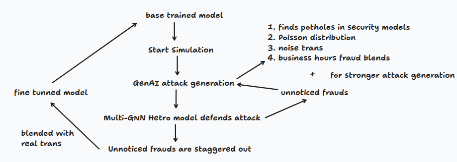
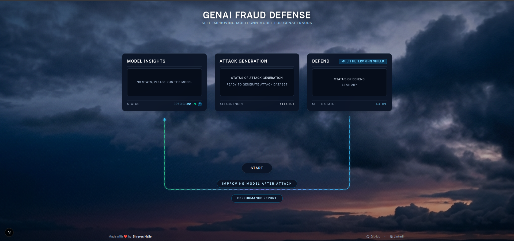
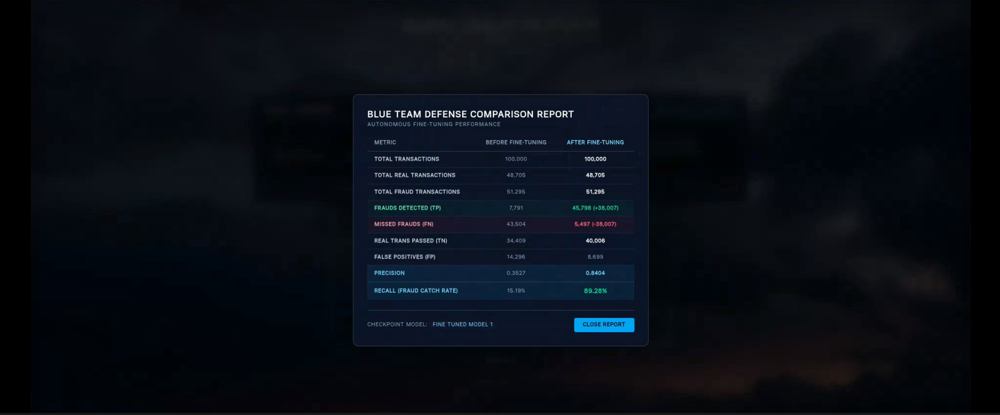

# GENAI FRAUD DEFENSE
### Self-Improving Multi-GNN Model for GenAI-Powered Payment Frauds

**GenAI Fraud Defense** is an autonomous, closed-loop Red Team vs Blue Team system designed to generate, evaluate and dynamically adapt to modern GenAI driven financial crimes. The system pairs an LLM-driven Red Team Adversarial Architect with a Heterogeneous Graph Neural Network (Multi-GNN) Blue Team Defense Model in a continuous active learning loop.

---

## 1. Fraud Vectors Covered (Identify Phase)

The system focuses on 5 high-impact, GenAI amplified financial crimes that challenge static rule engines and traditional machine learning models:

1. **Synthetic Identity & Mule Network Bootstrapping**  
   Stolen credentials and synthetic identities are combined to open bank accounts. These accounts remain dormant or low-activity before suddenly executing rapid fund transfers.
2. **Automated Smurfing & Micro-Splitting**  
   Large illicit financial targets are broken down into hundreds of randomized micro transactions below regulatory reporting thresholds, keeping the stolen amount untracked.
3. **Temporal Poisson Smoothing & Time-Delta Masking**  
   Transaction time intervals are sampled using stochastic Poisson process distributions to eliminate periodic burst signatures that trigger static anomaly rules, thus bypassing the trained model's detection capabilities mathematically. 
4. **Commercial Business Hours Masking**  
   Timestamps are automatically aligned with commercial banking windows (09:30 AM – 06:30 PM), blending malicious edges seamlessly into high volume domestic payments, which keeps the fraud out of sight.
5. **Graph Topology Evasion & Noise Injection**  
   Legitimate-looking "noise" transactions are strategically injected between malicious nodes to artificially lower node degree centrality, alter in/out port ratios and pass unnoticed. 

---

## 2. Red Team Attack Generation (Generative Red Team)

The **Red Team Engine** simulates evasive payment fraud through a two stage process:

1. **LLM Adversarial Architect**  
   The Red Team queries the LLM using transaction schemas and missed fraud patterns (`unnoticed_frauds.csv`). The LLM analyzes GNN blind spots and outputs raw JSON attack parameters specifying hub sizes, micro amount boundaries, Poisson time-delta rates and noise ratios.
2. **Procedural Execution Engine**  
   The execution engine scales the LLM parameters into 100,000 synthetic transaction datasets with dynamic fraud ratios (10,000 to 60,000 frauds). Transaction timestamps, amounts, payment channels and bank routing are synthesized in real time.

Thus covering all 5 identified GenAI fraud attacks above.

---

## 3. Blue Team Active Defense & Self-Improvement Loop

The **Blue Team Engine** intercepts and adapts to evasive attacks through an active learning feedback loop:

1. **Heterogeneous Graph Neural Network (Multi-GNN)**  
   The defense pipeline constructs a multi-relational graph (`Account` $\rightarrow$ `To` $\rightarrow$ `Account`) using PyTorch Geometric GINe layers with edge attribute updates. The baseline model evaluates the full incoming dataset to flag suspicious edges.
2. **Hard-Example Extraction & False Negative Mining**  
   Transactions missed by the baseline model (False Negatives) and false alarms (False Positives) are extracted to form a specialized hard-example training pool, which is later used for strengthening the model. 
3. **Autonomous GNN Fine-Tuning**  
   The GNN model undergoes 3 epochs of active fine-tuning using AdamW optimization and class-weighted cross entropy loss.
4. **Active Adaptation & Evasion Memory**  
   The fine-tuned model thus broadens its boundaries of fraud detection. Yet, the remaining missed frauds are again exported to `unnoticed_frauds.csv` so the Red Team LLM can target new model blind spots in subsequent cycles, thereby making the Red Team stronger in parallel as well. 

---

## 4. End-to-End System Workflow

### Vertical Execution Flow
```text
                   ┌───────────────────────────┐
                   │     Base Trained Model    │
                   └─────────────┬─────────────┘
                                 │
                                 ▼
                   ┌───────────────────────────┐
                   │      Start Simulation     │
                   └─────────────┬─────────────┘
                                 │
                                 ▼
 ┌──────────────────┐  ┌──────────────────┐
 │  GenAI Attack    │◄─┤ Unnoticed Frauds │◄───┐
 │    Generation    │  │ (Stronger Attack)│    │
 └────────┬─────────┘  └──────────────────┘    │
          │                                    │
          │ 1. Finds potholes in security      │
          │ 2. Poisson distribution            │
          │ 3. Noise transactions              │
          │ 4. Business hours fraud blends     │
          │                                    │
          ▼                                    │
 ┌──────────────────┐                          │
 │  Multi-GNN Hetero│──────────────────────────┘
 │   Defends Attack │
 └────────┬─────────┘
          │
          ▼
 ┌──────────────────┐
 │ Unnoticed Frauds │
 │  Staggered Out   │
 └────────┬─────────┘
          │
          ▼
 ┌──────────────────┐
 │  Blended with    │
 │Real Transactions │
 └────────┬─────────┘
          │
          ▼
 ┌──────────────────┐
 │ Fine-Tuned Model │─────────┐
 └──────────────────┘         │ (Updates Base Model)
          ▲                   │
          └───────────────────┘
```



---

## 5. Datasets and Model Insights

* **Base Training Dataset:** The core defense model was trained using the official [IBM Transactions for Anti-Money Laundering (AML) Dataset](https://www.kaggle.com/datasets/ealtman2019/ibm-transactions-for-anti-money-laundering-aml) hosted on Kaggle (`ealtman2019/ibm-transactions-for-anti-money-laundering-aml`).
* **Total Transactions (Graph Edges):** Processed **5,000,000 (5 Million) payment transactions** for feature extraction, node degree calculation, and graph edge attribute construction.
* **Total Accounts (Graph Nodes):** Built on a heterogeneous network graph consisting of **1,754,264 unique account nodes**.
* **Supported Currencies (15 Types):** Multi-currency transaction support including **US Dollar, Euro, UK Pound, Bitcoin, Yen, Yuan, Canadian Dollar, Rupee, Australian Dollar, Ruble, Shekel, Brazil Real, Mexican Peso, Swiss Franc, and Saudi Riyal**.
* **Payment Methods / Formats (7 Types):** Captures multi-channel financial flows across **ACH, Wire Transfer, Credit Card, Cheque, Cash, Bitcoin, and Reinvestment**.
* **Base Model Performance (Before Fine-Tuning):**
  * **Evaluation Benchmark:** Tested against a 100,000 transaction attack stream (39,790 fraudulent, 60,210 legitimate).
  * **True Positives (TP):** 28,086 detected frauds.
  * **False Negatives (FN):** 11,704 missed frauds.
  * **False Positives (FP):** 14,712 false alarms.
  * **True Negatives (TN):** 45,498 clean transactions verified.
  * **Baseline Precision:** 65.62%
  * **Baseline Recall / Detection Rate:** 70.59%
  * *Note: These figures represent the initial baseline GNN performance prior to autonomous Red Team active fine-tuning iterations.*

---

## 6. Video and Photos

### System Demonstration Video


### Screenshots



---

## 7. Developer & Code Inspection Guide

### System Prerequisites
Ensure you have the following installed on your machine:
* **Node.js** (v18.0.0 or higher) & **npm** (for Frontend)
* **Python** (v3.9 or higher) & **Conda** (for Backend)
* **Git** (for repository cloning)

### Tech Stack Details
* **Frontend:** Next.js (v16), React (v19), TypeScript, Tailwind CSS (v4), Recharts, Lucide React icons.
* **Backend:** FastAPI, Uvicorn, PyTorch (v2.9.1), PyTorch Geometric (PyG), Groq API, Pandas, NumPy, Scikit-learn, Python-dotenv.

---

### Local Setup & Execution

#### 1. Clone the Repository
```bash
git clone https://github.com/Shreyasnalle/Delusional.git
cd Delusional
```

#### 2. Backend Setup (FastAPI + PyTorch GNN)
```bash
# Create and activate conda environment
conda create -n mastermoney python=3.9 -y
conda activate mastermoney

# Navigate to backend directory
cd backend

# Install Python dependencies
pip install -r requirements.txt

# Create .env file with your Groq API key
echo "GROQ_API_KEY=your_groq_api_key_here" > .env

# Run FastAPI backend server
uvicorn main:app --port 8000 --reload
```
*(Backend running at `http://localhost:8000`)*

#### 3. Frontend Setup (Next.js + React + TypeScript)
```bash
# Open a new terminal and navigate to frontend directory
cd frontend

# Install Node modules
npm install

# Start Next.js development server
npm run dev
```
*(Frontend accessible at `http://localhost:3000`)*

---

## 8. Kaggle GPU Cloud Server Code

For training the model on larger graph datasets using **Kaggle GPU Instances** (Recommended Hardware: **Kaggle T4 x2 GPU**):

Run the following Python code block in a Kaggle Notebook cell to launch a remote Jupyter server via Cloudflare Tunnel:

```python
import os, time

os.system("fuser -k 9999/tcp 2>/dev/null")
time.sleep(2)
print("Port 9999 cleared.")

TOKEN = "delusional123"
PORT = 9999
os.system(f"jupyter notebook --ip=0.0.0.0 --port={PORT} --no-browser --allow-root --NotebookApp.token={TOKEN} --NotebookApp.disable_check_xsrf=True &")
time.sleep(5)
print("Jupyter started on port 9999.")

os.system("wget -q https://github.com/cloudflare/cloudflared/releases/latest/download/cloudflared-linux-amd64 -O cloudflared")
os.system("chmod +x cloudflared")
print("=" * 60)
print("YOUR IDE URL = https://<xxx>.trycloudflare.com/?token=delusional123")
print("Look for the trycloudflare.com link below:")
print("=" * 60)

os.system(f"./cloudflared tunnel --url http://localhost:{PORT}")
```
